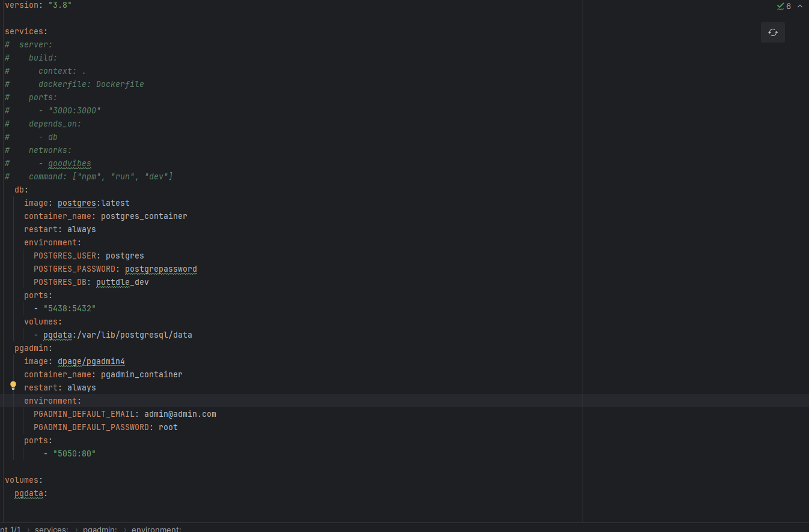
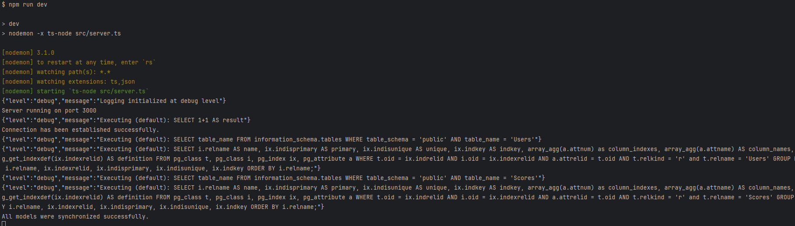

# Server

Running on Typescript with Express and the Sequelize-Typescript ORM, the server connects to a Postgres DB.
The server exposes a RESTful API for the client to interact with on port 3000.

# Getting started locally with Docker

## Docker DB setup

1. To run the server, you will need to have [Docker](https://www.docker.com/products/docker-desktop/) installed on your machine.
2. Go to `server/`
3. `cp .env.example .env` and add your vars, the `DB_HOST` will be `localhost`
4. Comment out the `server` service in the `docker-compose.yml` file
   
5. Run `docker-compose up` in the directory (if you want a detached terminal, run `docker-compose up -d` instead)
6. Run `npm run dev` in the root directory
7. You can now access the server at `http://localhost:3000` via Postman or any other API client.

## Full dockerized setup

1. To run the server, you will need to have [Docker](https://www.docker.com/products/docker-desktop/) installed on your machine.
2. Go to `server/`
3. `cp .env.example .env` and add your vars, the `DB_HOST` will be the service name in the `docker-compose.yml` file (`db`)
4. Run `docker-compose up` in the directory (if you want a detached terminal, run `docker-compose up -d` instead)
5. You can now access the server at `http://localhost:3000` via Postman or any other API client.

## Connecting to the Postgres DB in pgAdmin

1. Spin up your docker containers
2. To access the Postgres admin GUI (pgAdmin), go to `http://localhost:5050` and login with the credentials in the `docker-compose.yml` file.
3. After logging in, create a new server with the following credentials:
   - Hostname: `postgres`
   - Port: `5432`
   - Username: `look in docker-compose.yml`
   - Password: `look in docker-compose.yml`
4. You should now be able to see the `postgres` database and the tables within it.
5. You can now run queries on the database and see the results in the GUI.

If you need a video I'd look [here](https://youtu.be/qrnQFzuAHTw?si=T6yJ4RH0Q_EplI7N&t=439)
